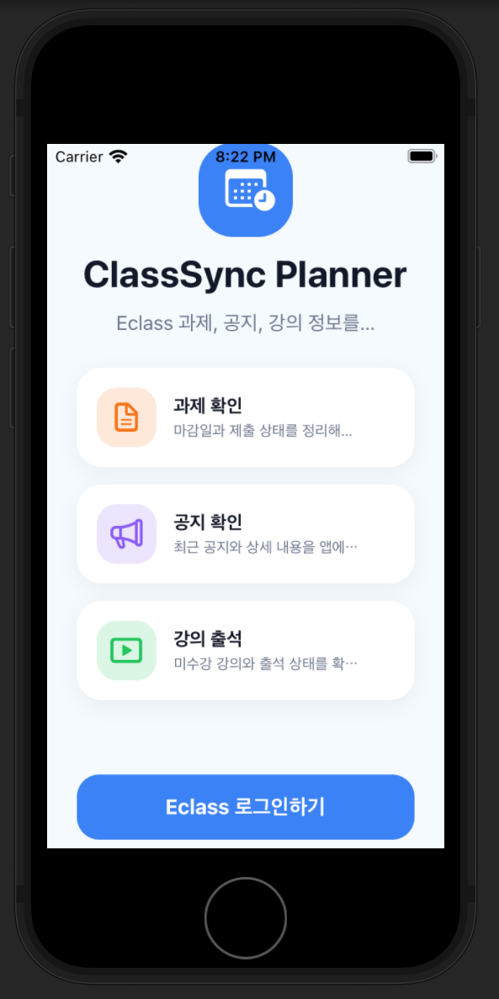
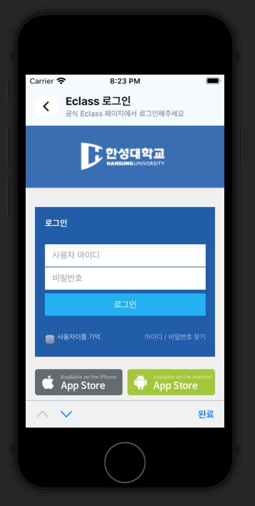
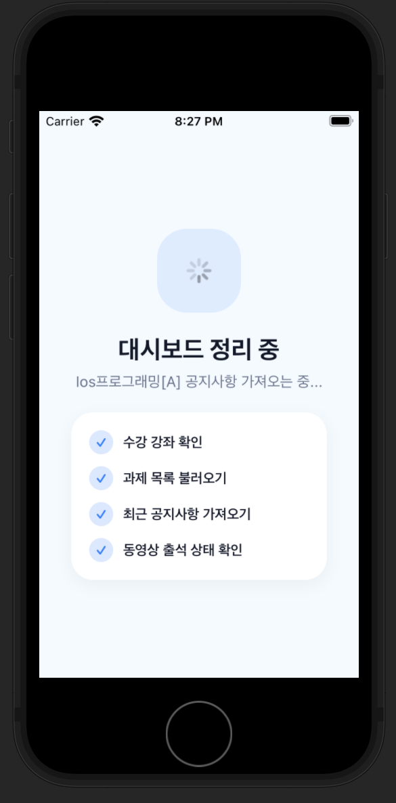
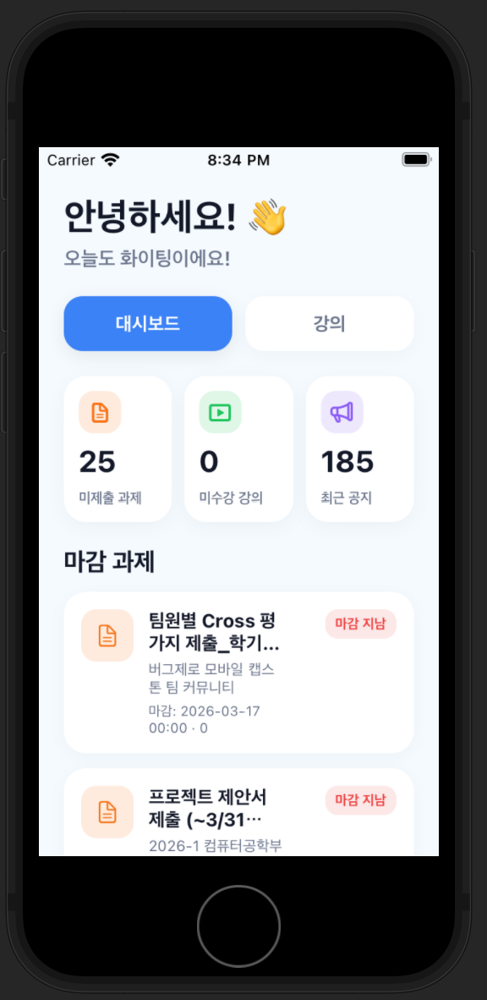
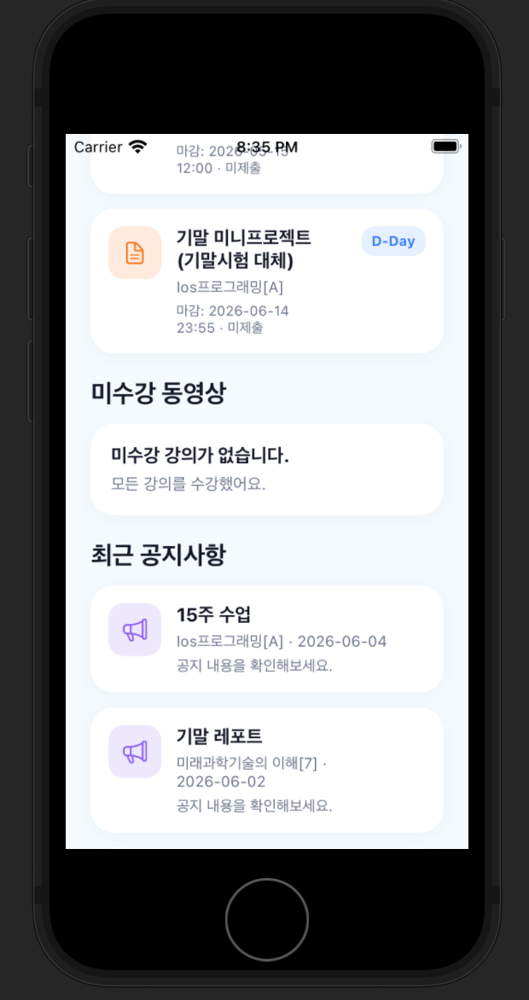
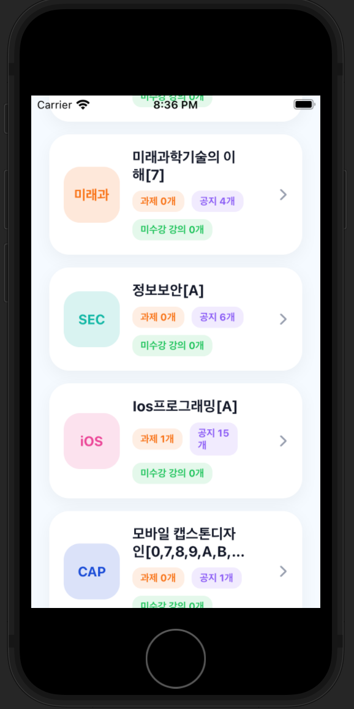
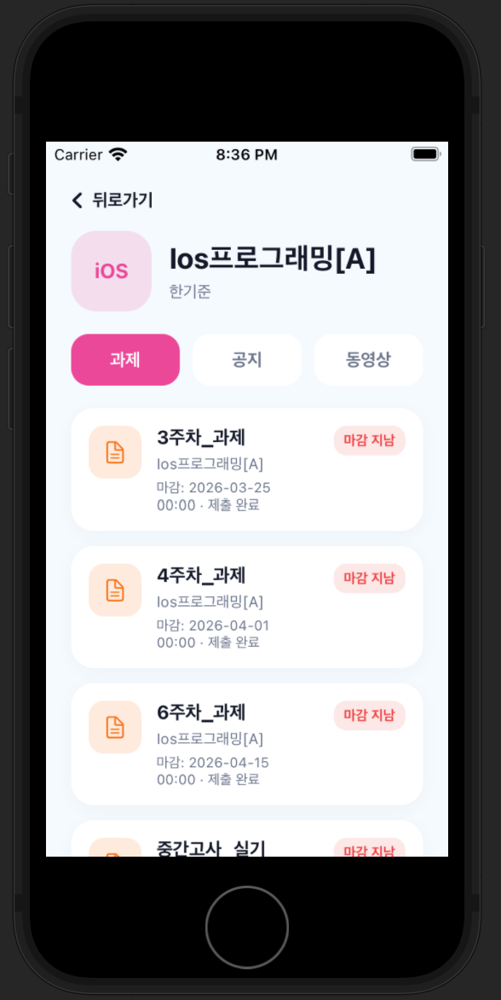
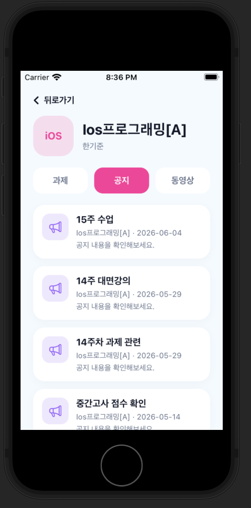
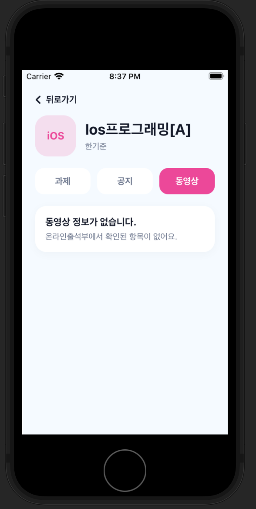

# ClassSync Planner

한성대학교 e-Class의 과제, 공지사항, 동영상 출석 정보를 한곳에서 확인할 수 있도록 제작한 iOS 학습 관리 앱입니다.

공식 e-Class 페이지에서 로그인한 뒤 수강 강좌와 강의별 정보를 자동으로 수집하여, 학생이 여러 강의 페이지를 일일이 방문하지 않고도 필요한 학습 정보를 빠르게 확인할 수 있도록 구성했습니다.

---

## 프로젝트 배경

e-Class에서는 과제, 공지사항, 동영상 강의 정보가 각각의 과목 페이지에 나누어져 있습니다.

학생이 전체 과제와 공지를 확인하려면 수강 중인 과목을 하나씩 열어 과제, 공지사항, 온라인 출석부를 따로 확인해야 합니다. 수강 과목이 많을수록 확인 과정이 반복되고, 과제 마감이나 새 공지를 놓칠 가능성도 커집니다.

ClassSync Planner는 이러한 불편을 줄이기 위해 여러 강의에 흩어진 정보를 한 화면에 모아 보여주는 것을 목적으로 제작했습니다.

---

## 프로젝트 목표

* e-Class의 여러 강의 정보를 한곳에서 확인할 수 있도록 구성
* 과제 마감일과 제출 상태를 빠르게 확인
* 최근 공지사항과 공지 상세 내용 확인
* 동영상 강의의 출석 및 미수강 상태 확인
* 과목별 정보를 과제, 공지, 동영상으로 구분하여 제공
* 공식 e-Class 로그인 페이지를 사용하여 로그인 정보를 앱에서 직접 저장하지 않도록 구성

---

## 주요 기능

### 1. 공식 e-Class 로그인

앱 자체 시작 화면에서 `Eclass 로그인하기` 버튼을 누르면 공식 e-Class 로그인 페이지가 열립니다.

사용자의 아이디와 비밀번호는 앱 자체 화면이 아닌 학교 공식 로그인 페이지에 입력됩니다.

### 2. 수강 강좌 자동 수집

로그인 후 `나의 강좌 - 수강 강좌` 페이지를 기준으로 사용자가 실제로 수강 중인 강좌 목록을 가져옵니다.

수강 강좌가 아닌 비교과 강좌나 공통 안내 페이지는 수집 대상에서 제외합니다.

### 3. 과제 정보 확인

각 과목의 과제 목록에서 다음 정보를 확인할 수 있습니다.

* 과제명
* 마감일
* 제출 상태
* 마감 여부

마감일이 지난 과제는 `D+숫자` 대신 `마감 지남` 상태로 표시합니다.

### 4. 공지사항 확인

대시보드에는 전체 과목의 최근 공지사항 5개를 표시합니다.

과목 상세 화면의 공지 탭에서는 해당 과목의 공지사항을 확인할 수 있으며, 공지를 선택하면 제목, 작성일, 작성자, 본문 내용을 볼 수 있도록 구성했습니다.

### 5. 동영상 출석 상태 확인

온라인 출석부 정보를 바탕으로 동영상 강의의 수강 여부를 확인합니다.

* 수강 완료
* 미수강
* 출석 미인정

### 6. 과목별 상세 화면

강의 목록에서 과목 카드를 선택하면 해당 과목의 상세 화면으로 이동합니다.

상세 화면은 다음 세 개의 탭으로 구성됩니다.

* 과제
* 공지
* 동영상

---

## 화면 구성

### 앱 시작 화면

앱을 실행하면 바로 e-Class 홈페이지가 열리지 않고, ClassSync Planner의 자체 시작 화면이 먼저 표시됩니다.

<p align="center">
  
</p>

---

### 공식 e-Class 로그인 화면

`Eclass 로그인하기` 버튼을 누르면 앱 내부 WebView에서 학교 공식 로그인 페이지가 열립니다.

<p align="center">
  
</p>

---

### 정보 동기화 화면

로그인이 완료되면 수강 강좌, 과제, 공지사항, 동영상 출석 정보를 순서대로 가져옵니다.

<p align="center">
  
</p>

---

### 메인 대시보드

대시보드에서는 전체 과목의 미제출 과제, 미수강 강의, 최근 공지 개수를 확인할 수 있습니다.

또한 마감 과제, 미수강 동영상, 최근 공지사항을 한 화면에 표시합니다.

<p align="center">
  
  
</p>

---

### 강의 목록 화면

강의 탭에서는 현재 수강 중인 과목을 카드 형태로 표시합니다.

각 카드에는 다음 정보가 표시됩니다.

* 남은 과제 개수
* 공지사항 개수
* 미수강 강의 개수

과목별 색상은 과목명에 따라 결정하지 않고, 표시되는 순서에 따라 미리 지정된 색상을 순환하여 적용합니다.

<p align="center">
  
</p>

---

### 과목 상세 화면

과목 카드를 선택하면 과제, 공지, 동영상 정보를 각각의 탭에서 확인할 수 있습니다.

<p align="center">
  
  
  
</p>

---

## 앱 동작 과정

1. 사용자가 ClassSync Planner를 실행합니다.
2. 시작 화면에서 `Eclass 로그인하기` 버튼을 선택합니다.
3. 공식 e-Class 페이지에서 로그인합니다.
4. `나의 강좌 - 수강 강좌` 페이지에서 실제 수강 강좌를 수집합니다.
5. 각 강좌의 과제, 공지사항, 동영상 출석 정보를 가져옵니다.
6. 수집한 정보를 SwiftUI 기반 대시보드에 표시합니다.
7. 사용자는 과목별 상세 화면에서 과제, 공지, 동영상 정보를 확인합니다.

---

## 사용 기술

* Swift
* SwiftUI
* WebKit
* WKWebView
* HTML Parsing
* Xcode 12.5
* iOS 14 이상

---

## 프로젝트 구조

```text
ClassSyncPlanner
├── ClassSyncPlannerApp.swift
├── ContentView.swift
├── LoginView.swift
├── WebLoginView.swift
├── LoadingView.swift
├── DashboardView.swift
├── CourseListView.swift
├── CourseDetailView.swift
├── Models.swift
├── Parser.swift
└── WebView.swift
```

---

## 실행 방법

1. 저장소를 내려받거나 복제합니다.

```bash
git clone 저장소주소
```

2. `ClassSyncPlanner.xcodeproj` 파일을 Xcode에서 엽니다.

3. 실행할 iPhone 시뮬레이터를 선택합니다.

4. Run 버튼을 눌러 앱을 실행합니다.

5. 앱에서 `Eclass 로그인하기` 버튼을 선택합니다.

6. 공식 e-Class 페이지에서 로그인합니다.

7. 정보 수집이 완료되면 대시보드가 표시됩니다.

---

## 기대 효과

ClassSync Planner를 사용하면 학생이 여러 과목의 강의 페이지를 반복해서 확인하지 않아도 됩니다.

과제, 공지사항, 동영상 출석 정보를 하나의 앱에서 확인할 수 있기 때문에 학습 정보를 찾는 시간을 줄일 수 있으며, 과제 마감이나 중요한 공지를 놓치는 상황을 줄이는 데 도움이 됩니다.

또한 과목별 정보를 동일한 형식으로 정리하여 제공하기 때문에, 수강 과목이 많아져도 현재 학습 상태를 직관적으로 확인할 수 있습니다.

---

## 소개 영상

```markdown
[ClassSync Planner 소개 영상 보기](영상 링크)
```
